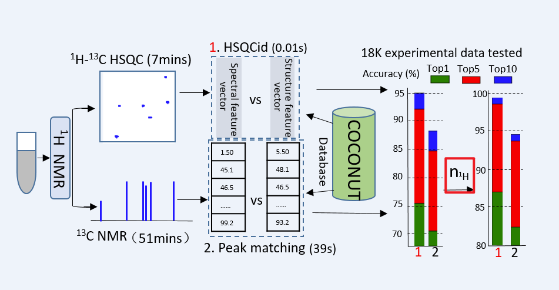

# HSCG
HSQCid: A Powerful Tool for Paving the Way to High-throughput Structural Dereplication of Natural Products Based on Fast NMR Experiments

**_Yuan, B.; Zhang, C.; Ji, C.; Liu, G.; Li, X.; Gong, S.; Huang, X.; Shen, A.; Li, X.; Liu, Y. HSQCid: A Powerful Tool for Paving the Way to High-Throughput Structural Dereplication of Natural Products Based on Fast NMR Experiments. Analytical chemistry 2025. DOI: 10.1021/acs.analchem.4c03102._**

# Data
The dataset is available at: BaiduYun (链接: https://pan.baidu.com/s/1YzDlfk_C-1zEefYz-EGSmA?pwd=ummg 提取码: ummg)

The Model is available at: BaiduYun (链接: https://pan.baidu.com/s/1u6kjXqVh13qoLiHleNrnqA?pwd=kgy5 提取码: kgy5)

This dataset contains about 398949 compounds of Coconut, we predict the NMR shift of 13C and 1H at ACD Lab.

# Requirements
We have tested the code on the following environment:
- python==3.9.13
- pytorch==1.12.1
- cudatoolkit=11.3.1
- cudnn==8.9.2.26
- numpy=1.23.1
You can install the required packages by: _pip install -r requirements.txt_

# Inference
1. Download the pretrained model and put it in the folder **./model/**
2. Put the mongodb file into MongoDB.
3. Determine model configuration file in **./configs/configs.yaml**
4. run the code: _python inference.py_
